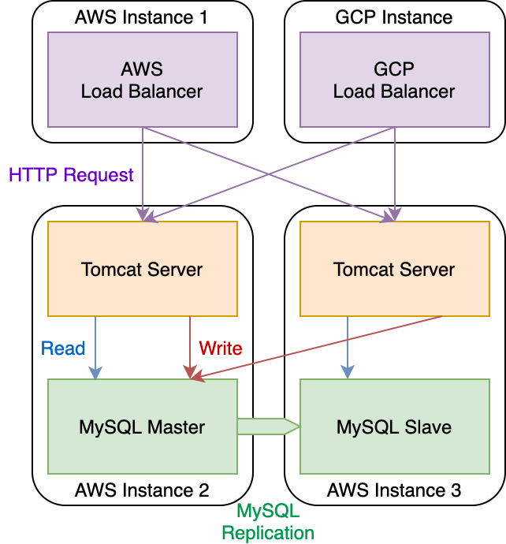

# cs122b-spring20-team-12

cs122b-spring20-team-12 created by GitHub Classroom

## Create Database

```bash
mysql -umytestuser -p < createtable.sql
mysql -umytestuser -p moviedb < movie-data.sql
mysql -umytestuser -p moviedb < add-quantity-to-sales.sql
mysql -umytestuser -p moviedb < set-missing-rating-to-zero.sql
mysql -umytestuser -p moviedb < stored-procedure.sql
```

## Server

See [server/README.md](./server/README.md).

## XML Parser

See [xml_parsing/README.md](./xml_parsing/README.md).

## Password Encryption

See [encrypt_password/README.md](./encrypt_password/README.md)

## Project 5

### General

- Team: 12
- Names: Qifan Yu, Tongjie Wang
- Project 5 Video Demo Link
    - YouTube: https://youtu.be/nwRz9DHRw5M
    - UCI ICS (backup): https://www.ics.uci.edu/~tongjiew/cs122b_proj5.mov
- Instruction of deployment: See [server/README.md](./server/README.md).
- Collaborations and Work Distribution:
    - Qifan Yu
        - Connection Pooling
        - Master/slave
        - Load balancing
    - Tongjie Wang
        - Log Processing Script
        - JMeter TS/TJ Time Measurement Report
        - Log files

### Connection Pooling
- Include the filename/path of all code/configuration files in GitHub of using JDBC Connection Pooling.
    - MoviesServlet:

        - https://github.com/UCI-Chenli-teaching/cs122b-spring20-team-12/blob/master/server/src/MoviesServlet.java
    - SingleMovieServlet:
      - https://github.com/UCI-Chenli-teaching/cs122b-spring20-team-12/blob/master/server/src/SingleMovieServlet.java
    - SingleStarServlet:
    
        - https://github.com/UCI-Chenli-teaching/cs122b-spring20-team-12/blob/master/server/src/SingleStarServlet.java
    - GenresServlet
      - https://github.com/UCI-Chenli-teaching/cs122b-spring20-team-12/blob/master/server/src/GenresServlet.java
    - LoginServlet
    
        - https://github.com/UCI-Chenli-teaching/cs122b-spring20-team-12/blob/master/server/src/LoginServlet.java
    - PaymentServlet
      - https://github.com/UCI-Chenli-teaching/cs122b-spring20-team-12/blob/master/server/src/PaymentServlet.java
    - DashboardServlet
    
        - https://github.com/UCI-Chenli-teaching/cs122b-spring20-team-12/blob/master/server/src/DashboardServlet.java
    - SingleStarServlet
      - https://github.com/UCI-Chenli-teaching/cs122b-spring20-team-12/blob/master/server/src/SingleStarServlet.java
    - Suggestion
    
        - https://github.com/UCI-Chenli-teaching/cs122b-spring20-team-12/blob/master/server/src/Suggestion.java
    - `context.xml`
        - https://github.com/UCI-Chenli-teaching/cs122b-spring20-team-12/blob/master/server/WebContent/META-INF/context.xml


#### How Connection Pooling is utilized in the Fabflix code
- Connection Pooling is utilized by adding the mysql connection pools to `context.xml` file.
- It helps to get an indolent connection from the corresponding connection pool for each servlet that needs to talk to the database,

#### How Connection Pooling works with two backend SQL
- Two connection Pooling are created to work with two backend (master, slave) SQL . A connection pool is created for master database
- The other connection pool is created for slave database.
- The ip addresses of master instance and slave instance are utilized to allow Tomcat on both instances to talk to each other’s database.


### Master/Slave
- Include the filename/path of all code/configuration files in GitHub of routing queries to Master/Slave SQL.
- `000-default.conf.2` (renamed to `000-default.conf` when deployed)
  - https://github.com/UCI-Chenli-teaching/cs122b-spring20-team-12/blob/master/configuration_files/000-default.conf.2

#### How read/write requests were routed to Master/Slave SQL



### JMeter

#### `log_processing.*` Instruction

`log_processing.py` (inside `server/jmeter_test`) has two modes: automatic and manual. To run it in automatic mode, in which the script will automatic run JMeter in command line mode, use `python log_processing.py --automatic`. To run it in manual mode, in which the script will open the JMeter GUI, use `python log_processing.py`. The average TS/TJ time will be shown in the output.

#### JMeter TS/TJ Time Measurement Report

| **Single-instance Version Test Plan**         | **Graph Results Screenshot**                                 | **Average Query Time(ms)** | **Average Search Servlet Time(ms)** | **Average JDBC Time(ms)** | **Analysis**                                                 |
| --------------------------------------------- | ------------------------------------------------------------ | -------------------------- | ----------------------------------- | ------------------------- | ------------------------------------------------------------ |
| Case 1: HTTP/1 thread                         |  | 14                         | 2.8762                              | 2.8426                    | This is the baseline of all other test cases. And about 2.8ms TS/TJ time with 14ms query time is resonable. |
| Case 2: HTTP/10 threads                       |  | 28                         | 17.0177                             | 16.9896                   | With multiple users log in simultaneously, it is resonable to see an increase of TS/TJ time and the query time. |
| Case 3: HTTPS/10 threads                      |  | 31                         | 19.0606                             | 19.0250                   | There is an very slight increase in response time. This may due to HTTPS overhead and the amount of sessions. But in general the time is still acceptable. |
| Case 4: HTTP/10 threads/No connection pooling |  | 42                         | 29.9225                             | 29.8733                   | Without connection pooling, the request takes much longer time to process, which is expected, because creating connection on each request is a relatively large overhead. |

| **Scaled Version Test Plan**                  | **Graph Results Screenshot**                                 | **Average Query Time(ms)** | **Average Search Servlet Time(ms)** | **Average JDBC Time(ms)** | **Analysis**                                                 |
| --------------------------------------------- | ------------------------------------------------------------ | -------------------------- | ----------------------------------- | ------------------------- | ------------------------------------------------------------ |
| Case 1: HTTP/1 thread                         |  | 16                         | 3.1063                              | 3.0542                    | Slightly slower than single-instance case 1. Since there is only one thread and sticky session is enabled, the load balancer cannot do too much here. |
| Case 2: HTTP/10 threads                       |  | 18                         | 5.2325                              | 5.2050                    | Here we can see how helpful the load balancer can be. By doing load balancing between two tomcat servers, the average TS/TJ time is about 1/3 of the single-instance case 2. |
| Case 3: HTTP/10 threads/No connection pooling |  | 28                         | 15.7617                             | 15.6108                   | Even without connection pooling, the scaled version still faster than the single instance version, showing how efficient load balancing can be. Similar to the single instance counterpart, disabling connection pooling will slow down the process of requests. |

## Project 4

### Demo

- https://youtu.be/4M5yHDaSDqQ (YouTube)
- https://www.ics.uci.edu/~tongjiew/proj4_take2.mov (backup, UCI ICS)

### Fuzzy Search

We implemented Levenshtein distance (edit distance) algorithm in C using dynamic programming. See [fuzzy_search/README.md](./fuzzy_search/README.md) for build instructions. We used the same strategy shown in the lecture slides

```mysql
SELECT * FROM movies WHERE min_edit_distance('user_input', title) <= 2;
```

### Project 4 Team Contribution

Qifan Yu
- Full-text search
- Autocomplete
- Android login page and movie list page
- Update servlet for fuzzy search

Tongjie Wang
- Autocomplete cache
- Android single movie page
- UDF

## Project 3

### Demo

- https://youtu.be/uRWX3kSkKsc (YouTube)
- https://www.ics.uci.edu/~tongjiew/cs122b_demo3.mov (backup, UCI ICS)
- https://drive.google.com/open?id=1xz8mGC2ft5IaRERoabmVkIZx_HFCTNtj (backup, Google Drive, need UCI account)

### XML Parsing Report

With our first implementation, the parsing and insert took more than 8 minutes to complete (no exact time available since we just terminated our program and started working on improvement).

Later, methods such as using a hash set to remove duplicates from xml files and adding indexes to speed up database-level duplication detection were added and the program tooks about 1 minute and 30 seconds to finish.

Finally, methods such as multithreading and batch insert were added and the program took about 1 minute to finish.

See [this issue](https://github.com/UCI-Chenli-teaching/cs122b-spring20-team-12/issues/2) or [Google Drive link](https://drive.google.com/open?id=1DpzkE_DnSuwqXifNqH6XxaKOgUlZ8NRz) (need UCI account) for inconsistency report.

### Queries with Prepared Statements

Files that use prepare statement:
- MoviesServlet
- SingleMovieServlet
- SingleStarServlet

Link to the files on GitHub:
- MoviesServlet:
- https://github.com/UCI-Chenli-teaching/cs122b-spring20-team-12/blob/master/server/src/MoviesServlet.java
- SingleMovieServlet:
- https://github.com/UCI-Chenli-teaching/cs122b-spring20-team-12/blob/master/server/src/SingleMovieServlet.java
- SingleStarServlet:
- https://github.com/UCI-Chenli-teaching/cs122b-spring20-team-12/blob/master/server/src/SingleStarServlet.java

### Project 3 Team Contribution

Qifan Yu
- Register a domain for fabflix
- Add HTTPS
- Use prepared statement
- Encrypt password for `customers` table
- Implement `add_movie` stored procedure

Tongjie Wang
- Add reCAPTCHA
- Encrypt password for `employees` table
- Implement a dashboard using stored procedure
- Import large XML data files into the Fabflix database

## Project 2

- https://youtu.be/eZkls9E3f-k
- https://drive.google.com/open?id=1faFV4_jPZK5V6kzxVqDxA706JQZZhLj4 (backup, need UCI Gmail account)
- https://youtu.be/_RVvliXncns
- We include 2 Youtube links in the Readme because in the first demo, we accidentally choose the wrong order <acse, acse> for the love search result, so we add second demo link to display the result.

Substring matching design:

We use LIKE in 18 mysql query of MoviesServlet.java from line 46 to 63.
- In line 46, I use movies.title LIKE "alnum%" to include the movies that starts with single alphanumerical (0,1,2,3..A,B,C...X,Y,Z) characters
- In line 47, I use name LIKE '"+genre+"'" to search for the movies that belong to certain genres
- In line 49, when (title is empty, year is empty, stat is empty, director is empty), I use movies.title LIKE '%"+title+"%'" to search for the movies that include certain characters in the title
- In line 50, when (!t && !y && !s && !d), I use movies.year = '"+year+"'" to search movies that their year include certain characters
- In line 51, when ( t && !y && !s && !d), I use movies.title LIKE '%"+title+"%'" to search for movies that include certain characters in title
- In line 52, when (!t && !y &&  s && !d), I use name LIKE '%"+star+"%'" to search for movies that include certain characters in the star name
- In line 53, when ( t &&  y && !s && !d), I use movies.year = '"+year and movies.title LIKE '%"+title+"%'" to search for movies that include certain characters in title and year
- In line 54, when ( t && !y && !s &&  d), I use movies.director LIKE '%"+director+"%' AND movies.title LIKE '%"+title+"%'" to search for movies that include certain characters in title and director
- In line 55, when ( t && !y &&  s && !d), I use movies.title LIKE '%"+title+"%' AND name LIKE '%"+star+"%'" to search for movies that include certain characters in title and star
- In line 56, when (!t &&  y && !s &&  d), I use movies.year = '"+year+"' AND movies.director LIKE '%"+director+"%'" to search for movies that include certain characters in year and director
- In line 57, when (!t &&  y &&  s && !d), I use movies.year = '"+year+"%' AND name LIKE '%"+star+"%'" to search for movies that include certain characters in year and star
- In line 58, when (!t && !y &&  s &&  d), I use movies.director LIKE '%"+director+"%' AND name LIKE '%"+star+"%'" to search for movies that include certain characters in director and star
- In line 59, when ( t && !y &&  s &&  d), I use movies.title LIKE '%"+title+"%' AND movies.director LIKE '%"+director+"%' AND name LIKE '%"+star+"%'" to search for movies that include certain characters in director, star and title
- In line 60, when (!t &&  y &&  s &&  d), I use movies.year = '"+year+"%' AND movies.director LIKE '%"+director+"%' AND name LIKE '%"+star+"%'" to search for movies that include certain characters in director, star and year
- In line 61, when ( t &&  y &&  s && !d), I use movies.year = '"+year+"%' AND movies.title LIKE '%"+title+"%' AND name LIKE '%"+star+"%'" to search for movies that include certain characters in title, star and year
- In line 62, when ( t &&  y && !s &&  d), I use movies.year = '"+year+"' AND movies.director LIKE '%"+director+"%' AND movies.title LIKE '%"+title+"%'" to search for movies that include certain characters in title, director and year
- In line 63, when ( t &&  y &&  s &&  d), I use movies.director LIKE '%"+director+"%' AND movies.year = '"+year+"%' AND movies.title LIKE '%"+title+"%' AND name LIKE '%"+star+"%'" to search for movies that include certain characters in title, star, director and year

### Project 2 Team contribution

Qifan Yu
- Main page browse and search 
- Movie List page, jump function and Single Pages 

Tongjie Wang
- Login page
- Shopping cart page, Payment Page, Place Order Action

## Project 1

Each of the member contributes approximately same amount of work to the repository.

- https://youtu.be/gOmATkxsDes
- https://drive.google.com/file/d/18nEbfqveqkul2HjDjRrNMgDTht2SCMOQ/view?usp=sharing (backup, need UCI Gmail account)
